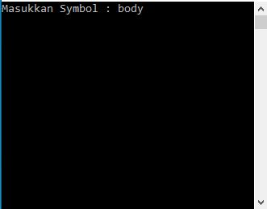
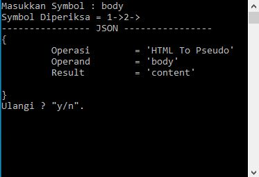

# codeTranslator
    Program ini Adalah dibuat sebagai operasi awal/analisa awal untuk membuat code translator,
    dimana didalam Program ini menggunakan repository/dictionary/kamus dengan memuat file
    dengan extension .dbaldes 
    dalam file tersebut satu symbol yang synonim dipisahkan dengan tanda "=" 
    dan newline sebagai punctuator antara symbol yang synonim dengan symbol yang synonim lainnya
    
    #catatan-programmer
        - Membuat Logika Operasi Sorting Database / Yang Lainnya yang mana digunakan
          untuk mengoptimalkan kecepatan Pencarian (Optional)
        - compare symbol selain qwerty (Soon)
        - operand for translate from file 

## symbol-translator - Progress 1.0
## Bahasa Pemograman 
    C#
## Database 
    AldesDB
## extension 
    .dbaldes //file for save symbol repository
    .aldes  //for read from file (On Progress)
    .cs //C#
    .exe //Runnable-Code Program
  
## Compile-Link Operation
     osx : csc Aldesdb/DbAldes.cs RecordTypeForKamus.cs Index.cs
     windows : csc Aldesdb\DbAldes.cs RecordTypeForKamus.cs Index.cs
 
## Operasi/Function
### Index
     1. bacaDatabase() //Operasi Utama

### AldesDB
     1. insilisasiDatabase(OperandNamaDatabase) // (Assign Database Name)
     2. terjemahkan(symbol1) //Menerjemahkan Symbol Baik Itu Dari A -> B atau B -> A (Di Cek Otomatis)
     3. cetakJSON(String Operasi1, String Operand1, String Result1) //Operasi Menampilkan Seperti JSON/RestFul API/Program Interface/RAW
     4. hitungProses(int Operand1) //Operasi Counter For Database Line Check On Runtime 
     5. operasiMutilasi(String operandLine) // Operasi Split String line With = AS Punctuator
     6. tampil() //Operasi Menampilkan Isi Database Kedalam Textual
     7. c(String txt) //akronim Console.Writeline(OperandString); 

## Dokumentasi

#### Operasi Input Symbol 
##### Operand Symbol Bisa Pseudo/HTML Hasil Dibaca Otomatis

#### Operasi-Compare With .dbaldes File
#### Manampilkan Data Dalam Bentuk JSON

# ALDESFI ARIFIN
